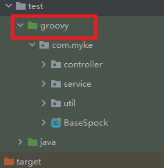
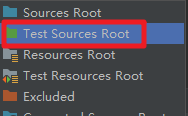

# spock 测试

## 环境准备

1. maven 依赖

```xml

<dependency>
    <groupId>org.spockframework</groupId>
    <artifactId>spock-core</artifactId>
    <version>${spock-spring.version}</version>
    <scope>test</scope>
</dependency>

        <!--如果是在Spring环境下测试时，添加该依赖-->
<dependency>
<groupId>org.spockframework</groupId>
<artifactId>spock-spring</artifactId>
<version>${spock-spring.version}</version>
<scope>test</scope>
</dependency>


<plugin>
<groupId>org.codehaus.gmavenplus</groupId>
<artifactId>gmavenplus-plugin</artifactId>
<version>1.13.0</version>
<executions>
    <execution>
        <goals>
            <goal>compile</goal>
            <goal>compileTests</goal>
        </goals>
    </execution>
</executions>
</plugin>
```

2. test/groovy 创建groovy目录,新设置为测试资源文件夹
   



3. idea 安装插件,可以检查 spock的语法
   
   插件：spock-framework-enhancements


## Groovy 语法
> 参考：<br/>
> https://www.jianshu.com/p/fbfaaecc19ee
> https://www.cnblogs.com/yufecheng/p/11302777.html

- Groovy支持?.安全占位符，这个运算符主要用于避免空指针异常
  ```groovy
  // ?语法类似于.Net或kotlin的空指针安全，为null则不调用resultCode属性
  response?.resultCode == status
  ```
- Groovy支持.@直接域访问操作符，因为Groovy自动支持属性getter方法，
  但有时候我们有一个自己写的特殊getter方法，
  当不想调用这个特殊的getter方法则可以用直接域访问操作符
  ```groovy
    user.@name
  ```
- Groovy默认会提供一个包含所有对象属性的构造方法。而且调用方式上可以指定属性名
  ```groovy
     def user1 = new UserDTO(id: 1, name: "张三", province: "上海")
  ```  

## Spock 语法
> 参考：<br/>
> https://gitee.com/ZJB2020/demo-spock
> 
> [Spock单元测试框架以及在美团优选的实践] https://mp.weixin.qq.com/s/U1FArrcdFf3NKui6_Sf-qw
> 
> [Spock 系列文章] https://javakk.com/category/spock
> 
> [Springboot 单元测试（groovy、spock）] https://zhuanlan.zhihu.com/p/148371539
> 
> [Spock 官网] https://spockframework.org/

Spock提供多种语义标签，如：given、when、then、expect、where、with、and等，
从行为上规范了单元测试代码，每一种标签对应一种语义。
让单元测试代码结构具有层次感，功能模块划分更加清晰，也便于后期的维护。

单元测试代码Spock会强制要求使用given、when、then这样的语义标签（至少一个），否则编译不通过。
每个标签后面的双引号里可以添加描述。
> - given：输入条件（前置参数）,mock 单测中指定 mock 数据
> - when：执行行为（Mock接口、真实调用）
> - then：输出条件（验证结果）
> - and：衔接上个标签，补充的作用
> - where: 以表格的形式提供测试数据集合
> - expect: 期望的行为，when-then 的精简版
> - thrown: 如果在 when 方法中抛出了异常，则在这个子句中会捕获到异常并返回
> - def setup() {} ：每个测试运行前的启动方法
> - def cleanup() {} : 每个测试运行后的清理方法
> - def setupSpec() {} : 第一个测试运行前的启动方法
> - def cleanupSpec() {} : 最后一个测试运行后的清理方法
> - @Ignore: 忽略测试方法
> - @IgnoreRest：只测试这个方法，而忽略所有其他方法
> - @Timeout： 设置测试方法的超时时间，默认单位为秒
> - @Stepwise: 当测试方法间存在依赖关系时，标明测试方法将严格按照其在源代码中声明的顺序执行

```
1. 两个右箭头 >> 就是指定返回结果,类似Mockito的when().thenReturn()语法
   studentDao.getStudentInfo() >> [student1,student2] >> [student3,student4] >> [student5,student6]
2. 如果要指定返回多个值的话, 可以使用3个右箭头>>>,表示同一方法多次按顺序调用返回不同值
   
3. 使用下划线_匹配参数，表示任何类型的参数，多个逗号隔开，类似于Mockito的any()方法,
   如果类中存在多个同名方法，可以通过 _ as参数类型 的方式区别调用  
   
   // _ 表示匹配任意类型参数
   List<StudentDTO> students = studentDao.getStudentInfo(_);

  // 如果有同名的方法，使用as指定参数类型区分
  List<StudentDTO> students = studentDao.getStudentInfo(_ as String); 
4. then块中使用了Spock的with功能，可以验证返回结果response对象内部的多个属性是否符合预期值  
5. where模块第一行代码是表格的列名，多个列使用|单竖线隔开，||双竖线区分输入和输出变量，即左边是输入值，右边是输出值
   输入参数1 | 输入参数2 || 输出结果1 | 输出结果2
6. @Unroll注解，可以把每一次调用作为一个单独的测试用例运行，这样运行后的单元测试结果更加直观   
7. 在then标签里用到了Spock的thrown()方法，这个方法可以捕获我们要测试的业务代码里抛出的异常
8. @PowerMockRunnerDelegate(Sputnik.class)注解,交给Spock代理执行，这样既可以使用Spock + Groovy的各种功能，又可以使用PowerMock的对静态，final,私有方法等方法的Mock
9. 如果单元测试代码不需要对静态方法、final方法Mock，就没必要使用PowerMock，使用Spock自带的Mock()就足够了 
   
```


## 测试类

- CalcServiceUtilsTest
- IDNumberUtilsTest
- CalendarUtilsTest

- UserServiceTest
- UserControllerTest  
- UserServiceStaticTest
- OrderServiceStaticTest
- AbstractServiceTest
- ResponseServiceTest
- SpockSpyServiceTest


